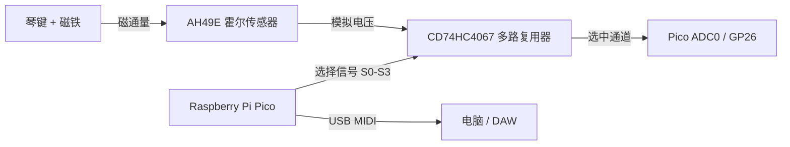

# Pico 磁轴 MIDI 键盘 - 技术白皮书

## 1. 项目概览
本项目基于 **Raspberry Pi Pico (RP2040)** 和 **霍尔传感器 (AH49E)** 实现了一个 13 键的磁轴 MIDI 键盘。与传统的机械开关键盘不同，本系统利用连续的模拟磁场感应来模拟真实钢琴的细腻响应，支持动态力度感应（Velocity Sensitivity）和可调节的触发点（Actuation Points）。

**核心特性：**
*   **模拟感应：** 通过 CD74HC4067 多路复用器高速扫描 13 个霍尔传感器。
*   **动态力度：** 基于两个虚拟阈值之间的行程时间计算“双点”力度 (Dual-point Velocity)。
*   **施密特触发器逻辑：** 软件定义的迟滞比较器 (Hysteresis) 防止信号抖动导致的误触。
*   **八度切换：** 实时移调（-2 到 +2 八度），并配有 LED 指示灯。
*   **防卡音 (Stuck Note Prevention)：** 智能音符记忆功能，确保 `Note Off` 信号始终对应触发时的音高，即使在按住琴键时切换了八度设置也不会卡音。
*   **USB MIDI：** 基于 TinyUSB 协议栈，即插即用。

---

## 2. 硬件架构

### 2.1 组件逻辑
系统核心依赖于读取磁铁（安装在琴键上）靠近霍尔传感器（固定在 PCB 上）时的模拟电压变化。



### 2.2 引脚配置 (Pin Configuration)
*   **多路复用器控制 (Multiplexer Control):** `GP0`, `GP1`, `GP2`, `GP3` (地址选择)
*   **模拟输入 (Analog Input):** `GP26` (ADC0) -> Mux 公共输出 (Common Output)
*   **用户界面 (User Interface):**
    *   **按键 (Octave -/+):** `GP15`, `GP16` (低电平有效 Active Low, 上拉)
    *   **LED 指示灯:** `GP10` - `GP14` (高电平有效 Active High)

---

## 3. 目录结构

本项目采用模块化的 Raspberry Pi Pico SDK C/C++ 架构。

```
MidiKeyboard/
├── CMakeLists.txt          # 构建配置 (Pico SDK + TinyUSB)
├── README.md               # 技术白皮书 (本文档)
├── PCB&Schematic/          # 硬件设计文件 (PCB & 原理图)
├── REF/                    # 参考资料 (IO 引脚表等)
└── src/
    ├── main.cpp            # 程序入口：硬件初始化、主循环、八度逻辑
    ├── hardware_config.h   # 引脚定义和硬件常量 (Source of Truth)
    ├── keyboard_types.h    # 核心数据结构 (Key, KeyState)
    ├── fsm.c / .h          # 有限状态机 (核心逻辑 The Core Logic)
    ├── adc_scanner.c / .h  # 底层 ADC 和 Mux 驱动
    ├── signal_processing.c # 归一化、校准、死区处理
    ├── midi_handler.c      # TinyUSB MIDI 封装函数
    ├── mux.c               # 多路复用器 GPIO 控制
    ├── calibration.c       # 出厂校准数据管理
    └── tusb_config.h       # TinyUSB 配置 (启用 MIDI Class)
```

---

## 4. 软件运行逻辑 (Software Operation Logic)

### 4.1 主循环 (`main.cpp`)
系统运行在一个持续的超级循环 (Super-loop) 中，执行三个关键任务：
1.  **UI 轮询**: 检查八度按键状态并更新 LED。
2.  **硬件扫描**: 读取所有 13 个传感器的原始数据。
3.  **逻辑处理**: 对每个按键进行信号归一化，并推演其状态机。

### 4.2 信号处理流水线 (Signal Processing Pipeline)
原始 ADC 值 (0-4095) 通常带有噪声且物理一致性较差，它们经过以下处理：
1.  **校准 (Calibration)**: 将 `raw` 值映射到存储的 `min` (静止位) 和 `max` (触底位)。
2.  **死区 (Deadzone)**: 顶部和底部的 2-5% 信号被强制修剪为 0 或 1，消除噪声干扰。
3.  **归一化 (Normalization)**: 转换为浮点数 `0.0` (松开) 到 `1.0` (按下)。

### 4.3 有限状态机 (`fsm.c`)
这是键盘的心脏。每个按键都有一个独立的状态机 (FSM)：

1.  **IDLE (空闲)**: 等待位置值 > `THRESHOLD_T1` (0.05)。
    *   *动作*: 记录 `t1_time`。进入 **PRESS_DETECTED** 状态。
2.  **PRESS_DETECTED (检测到按下)**: 计时器运行中。等待位置值 > `THRESHOLD_T2` (0.40)。
    *   *动作*:
        *   计算时间差 `delta_t = now - t1_time`。
        *   计算力度 (Velocity): `127 * (SpeedFactor / delta_t)^Curve`。
        *   **发送 MIDI Note On**。
        *   **存储音符**: 将当前音高保存到 `active_midi_note`。
        *   进入 **NOTE_ON** 状态。
    *   *退出条件*: 如果在到达 T2 之前位置值回落到 `THRESHOLD_RESET` 以下，则返回 **IDLE** (去抖动)。
3.  **NOTE_ON (保持发音)**: 按键被按住。等待位置值 < `THRESHOLD_RESET` (0.04)。
    *   *动作*:
        *   **发送 MIDI Note Off** (使用 `active_midi_note` 中存储的音高)。
        *   进入 **IDLE** 状态。

### 5. 关键函数指南

#### `process_key_state()` (位于 `src/fsm.c`)
逻辑: 更新 FSM。处理所有阈值判断、力度计算和 MIDI 事件触发。
重要性: 这是键盘逻辑的核心。

#### `key_info_normalize()` (位于 `src/signal_processing.c`)
逻辑: 接收原始 `uint16_t` 值，应用最小/最大校准和死区，返回 `0.0-1.0` 的浮点数。
重要性: 标准化磁铁之间的物理差异，确保所有按键手感一致。

#### `adc_scan_all()` (位于 `src/adc_scanner.c`)
逻辑: 循环切换多路复用器通道 0-12，加入微小延迟以等待信号稳定，然后填充缓冲区。
重要性: 确保数据采集的同步性。

## 6. 固件烧录 (Firmware Flashing)

如果您不想从源码编译，可以直接使用 `build` 目录中已经生成好的固件：

*   **文件路径:** `build/MidiKeyboard.uf2`
*   **使用方法:**
    1.  按住 Raspberry Pi Pico 上的 **BOOTSEL** 按钮。
    2.  通过 USB 将 Pico 连接到电脑（此时电脑会识别为一个 U 盘）。
    3.  松开按钮。
    4.  将 `MidiKeyboard.uf2` 文件直接拖入该 U 盘中。
    5.  Pico 会自动重启，键盘即可正常使用。

## 7. 编译指南 (Build from Source)

**前置要求:**
*   CMake & Ninja
*   ARM GCC Toolchain
*   Raspberry Pi Pico SDK

**指令:**
```bash
mkdir build
cd build
cmake -G "Ninja" ..
ninja
```
这将生成 `MidiKeyboard.uf2` 文件。按住 BOOTSEL 按钮连接 Pico，将该文件拖入出现的 USB 大容量存储设备中即可。
